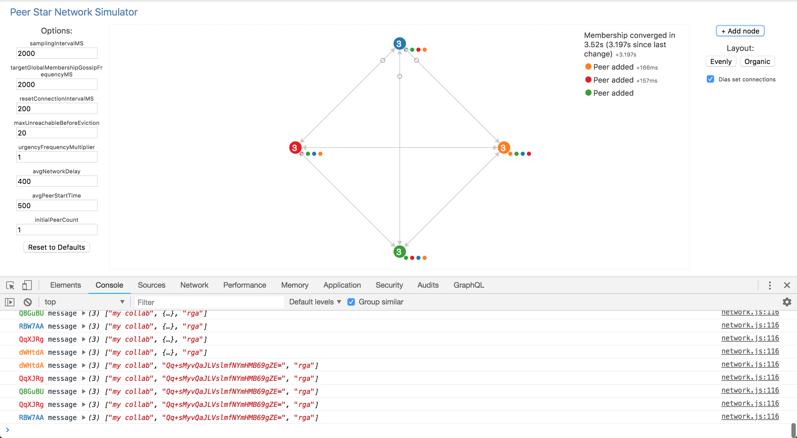

# peer-star-app - Collaboration Membership Simulator

Peer Star App comes with a simple collaboration membership simulator at sim/index.html

## Usage

[Demo video (2 minutes)](https://www.youtube.com/watch?v=3OZqLg9iu9w&feature=youtu.be)
To run the simulator just open sim/index.html

Peers send two kinds of messages
1. the hash of the peer's view of collaboration membership, represented by an empty circle
2. the CRDT state of the peer's view of collaboration membership, represented by filled circles (one for each member)

Add nodes by clicking on the `+ Add node` button at the top right.

By default peers are laid out equidistantly along a circle. Layout `Evenly` and `Organic` buttons switch between equidistant and actual distance in the network ring.

The `Dias set connections` checkbox toggles whether to show connections between peers (connections are made according to the peer's [Dias set](https://github.com/ipfs-shipyard/peer-star-app/blob/master/docs/PROTOCOL.md#computing-the-set-of-target-peers))

## Development

Run `yarn sim:watch` to compile changes to the code. This will also watch for any further changes to files included by the simulator and compile them automatically.
